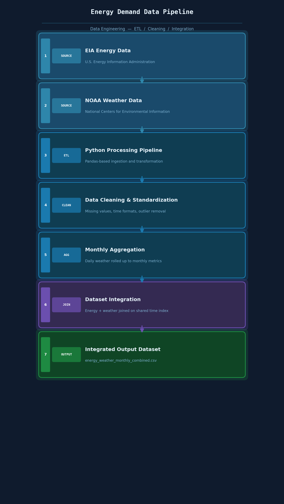
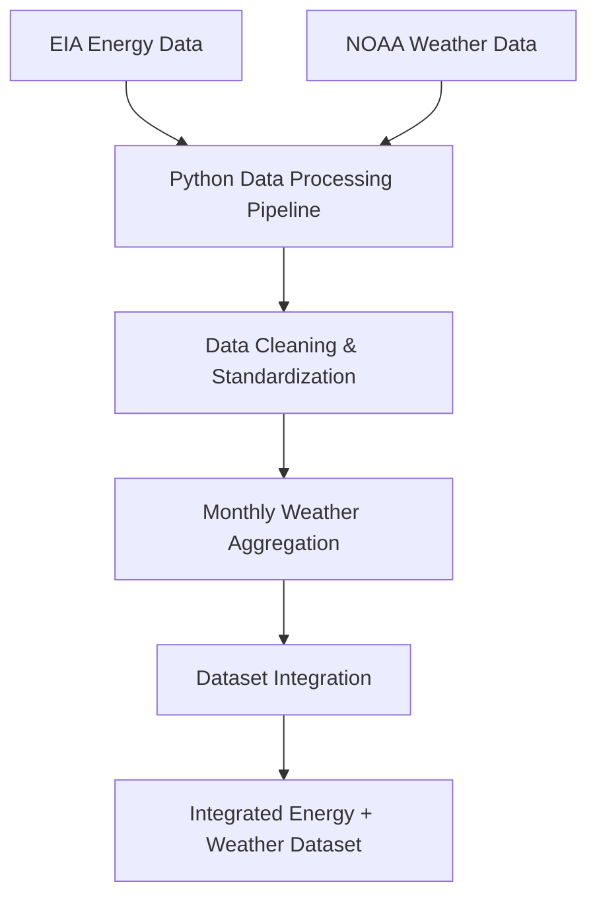

# Energy Demand Data Pipeline

A data processing pipeline that integrates energy consumption data with weather observations to produce a cleaned, analysis-ready dataset. The pipeline demonstrates common data engineering tasks including data ingestion, transformation, cleaning, and dataset integration using Python and Pandas.

The resulting dataset can be used to explore how weather patterns influence energy demand over time.

---

## Problem

Energy demand fluctuates based on many factors, including seasonal weather patterns. However, raw energy consumption datasets and weather datasets are often stored separately and contain inconsistencies such as missing values, incompatible time formats, and different aggregation levels.

Without preprocessing and integration, these datasets are difficult to analyze together.

---

## Solution

This project implements a data wrangling pipeline that:

- Ingests raw energy consumption and weather datasets
- Cleans and standardizes the data
- Aggregates weather data into monthly metrics
- Integrates both datasets into a single combined dataset

The final dataset enables exploration of relationships between temperature patterns and energy demand.

---

## System Architecture





### Key Components

| Component | Description |
|---|---|
| **Data Ingestion** | Reads raw CSV files from EIA and NOAA sources |
| **Cleaning Layer** | Handles missing values, time format normalization, and outliers |
| **Aggregation** | Rolls daily weather observations up to monthly metrics |
| **Integration** | Joins energy and weather datasets on a shared time index |
| **Output** | Cleaned CSVs ready for analysis or modeling |

---

## Technologies Used

- Python
- Pandas
- Jupyter Notebook
- CSV Data Processing
- Data Cleaning & Transformation

---

## Project Structure

```
energy-demand-data-pipeline/
├── data/
│   ├── raw/
│   │   ├── eia_energy_consumption_raw.csv
│   │   └── weather_cincinnati_daily_raw.csv
│   └── cleaned/
│       ├── energy_consumption_cleaned.csv
│       ├── weather_cincinnati_monthly_clean.csv
│       └── energy_weather_monthly_combined.csv
├── images/
│   └── energy_pipeline_architecture.png
├── energy_weather_pipeline.ipynb
├── main.py
├── data_source.txt
└── README.md
```

---

## Data Sources

| Dataset | Provider | Link |
|---|---|---|
| Energy Consumption Data | U.S. Energy Information Administration (EIA) | [eia.gov](https://www.eia.gov/) |
| Weather Data | NOAA National Centers for Environmental Information | [ncei.noaa.gov](https://www.ncei.noaa.gov/) |

---

## Key Features

- Data ingestion from multiple sources (EIA + NOAA)
- Data cleaning and preprocessing
- Time-series aggregation to monthly granularity
- Dataset integration across energy and weather domains
- Reproducible pipeline for analysis and extension

---

## Future Improvements

- [ ] Automate the pipeline using a workflow orchestration tool (Airflow or Prefect)
- [ ] Integrate additional weather variables such as humidity or wind speed
- [ ] Deploy the pipeline using cloud storage and processing services (AWS S3 + Lambda)
- [ ] Build predictive models to forecast energy demand based on weather conditions
- [ ] Add data validation checks before and after transformation steps
